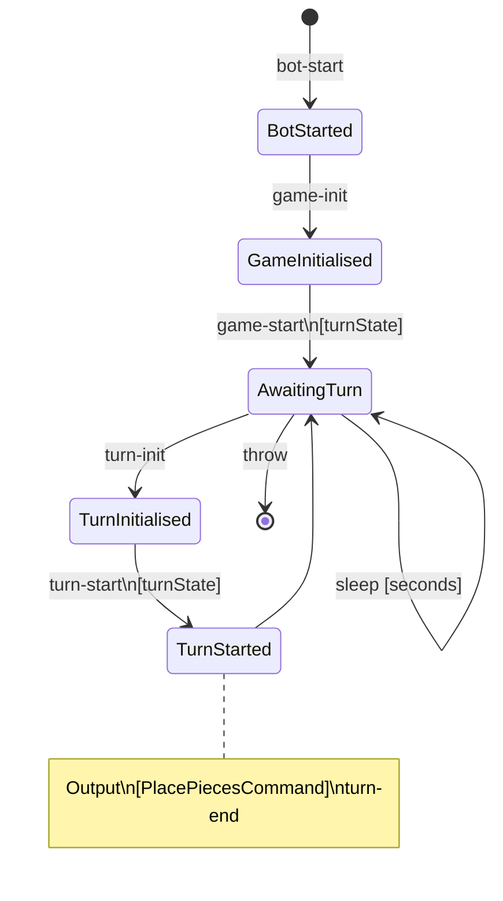

# Infinibattle L-game bot

## Development

```shell
# Run the tests.
go test ./...

# Format the code.
go fmt ./...

# Run the bot.
go run ./main.go
```

## Bot State Diagram


```mermaid
stateDiagram-v2

[*] --> BotStarted: bot-start
BotStarted --> GameInitialised: game-init
GameInitialised --> AwaitingTurn: game-start\n[turnState]
AwaitingTurn --> TurnInitialised: turn-init
TurnInitialised --> TurnStarted: turn-start\n[turnState]
TurnStarted --> AwaitingTurn

AwaitingTurn --> [*]: throw
AwaitingTurn --> AwaitingTurn: sleep [seconds]

note right of TurnStarted: Output\n[PlacePiecesCommand]\nturn-end

```
