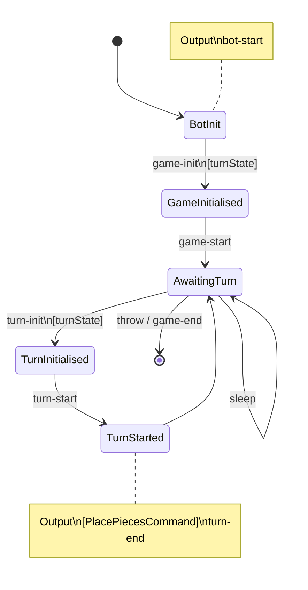

# Infinibattle L-game bot

## Development

```shell
# Run the tests.
go test ./...

# Format the code.
go fmt ./...

# Run the bot.
go run ./main.go
```

## Bot State Diagram



## Research

There are 48 ways to place an L on an empty board.
Of those, 24 ways score a point.
Placing 2 neutral pieces gives a total of 1584 possible boards (66 ways per scoring state).
Placing the second L gives a total of 12320 possible boards.
For these boards, each arrangement allows the opponent to make between 1 and 9 scoring moves (inclusive).
There are 16 arrangements (2 if you remove rotations and reflections) where the opponent (blue) has only a single scoring move:

```
┌─────────┐
│ R □ □ N │
│ R □ □ □ │
│ R R □ □ │
│ □ □ N □ │
└─────────┘

┌─────────┐
│ R □ □ N │
│ R □ □ □ │
│ R R □ □ │
│ □ □ □ N │
└─────────┘
```
