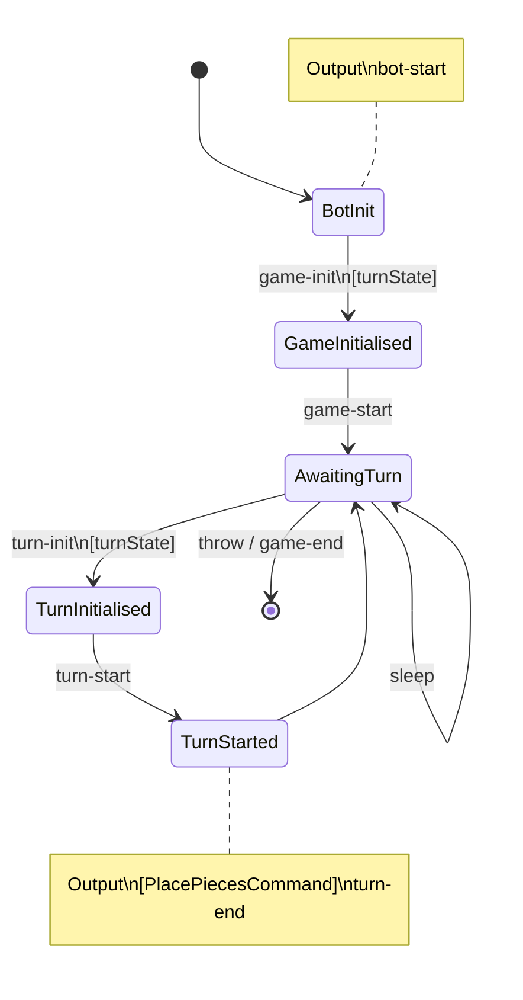

# Infinibattle L-game bot

A bot designed to play the [L game](https://en.wikipedia.org/wiki/L_game).

## Strategy

One major difference with the "classic" version of the L game is that this bot is designed for a version where only score matters, and getting locked in does _not_ mean a loss.

The overall strategy consists of these steps:

- If we are ahead in score, try to find a move which locks the opponent in. If not, or if such a move doesn't exist, continue.
- Find the best move out of all moves where we score a corner point. If there are no such moves, continue.
- Find the best move out of all moves.

The "best" move is found by rating the possible move options based on how many scoring opportunities it gives the opponent.

### Research

The `main.go` file contains an extra `main2` function, which when ran outputs some information about the score blocking options.

#### Findings

There are 48 ways to place an L on an empty board.
Of those, 24 ways score a point.
Placing 2 neutral pieces gives a total of 1584 possible boards (66 ways per scoring state).
Placing the second L gives a total of 12320 possible boards.
For these boards, each arrangement allows the opponent to make between 1 and 9 scoring moves (inclusive).
There are 16 arrangements (2 if you remove rotations and reflections) where the opponent (blue) has only a single scoring move:

```
┌─────────┐
│ R □ □ N │
│ R □ B B │
│ R R □ B │
│ □ □ N B │
└─────────┘

┌─────────┐
│ R □ □ N │
│ R □ □ □ │
│ R R B □ │
│ B B B N │
└─────────┘
```

## Development

```shell
# Run all tests and benchmarks
./testbench.sh

# Format the code.
go fmt ./...

# Run the bot.
go run ./main.go
```

## Bot State Diagram


